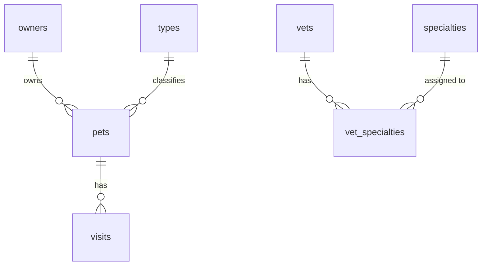

# Spring PetClinic — Entity Relationship Diagram (Quick Reference)

A simplified view showing entity names and relationships only.
For full field details see [erd.md](./erd.md).

## Entities

| Entity | Description |
|---|---|
| `owners` | Pet owners — name, address, city, telephone |
| `pets` | Pets belonging to an owner — name, birth date, type |
| `types` | Pet type lookup (e.g. Cat, Dog, Hamster) |
| `visits` | Vet visit records for a pet — date, description |
| `vets` | Veterinarians — name |
| `specialties` | Vet specialty lookup (e.g. Dentistry, Surgery) |
| `vet_specialties` | Many-to-many join table between vets and specialties |
