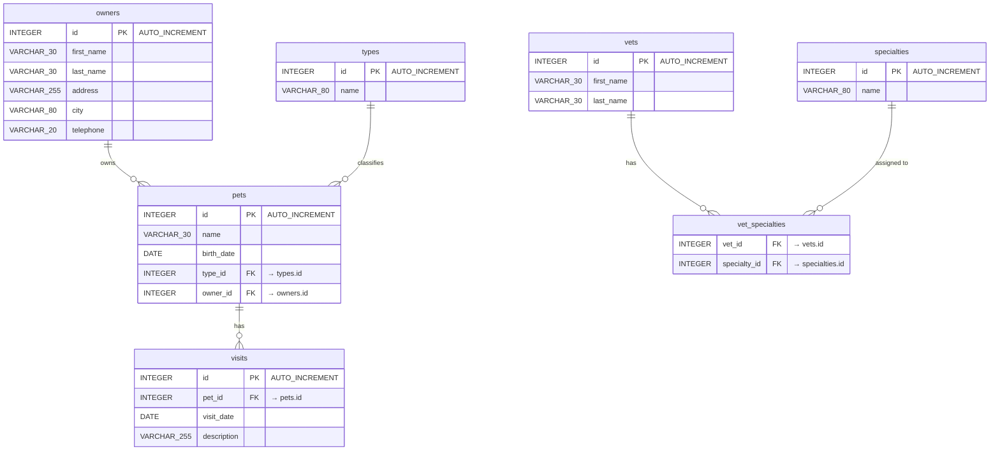

# Spring PetClinic — Entity Relationship Diagram

This document describes the full domain model of the Spring PetClinic application,
derived from the JPA entity classes and the SQL schema files.

## Inheritance Hierarchy (JPA `@MappedSuperclass`)

| Abstract Base    | Fields                    | Concrete Entities that extend it |
|------------------|---------------------------|-----------------------------------|
| `BaseEntity`     | `id` (Integer, PK)        | All entities (transitively)       |
| `NamedEntity`    | `id`, `name`              | `PetType`, `Specialty`, `Pet`     |
| `Person`         | `id`, `firstName`, `lastName` | `Owner`, `Vet`               |

> `@MappedSuperclass` classes are **not** mapped to their own table — their columns are
> inlined into each concrete entity's table.

---

## Full ERD

---

## Relationship Summary

| Relationship | Cardinality | Notes |
|---|---|---|
| Owner → Pet | One-to-Many | `pets.owner_id` FK; cascade ALL, fetch EAGER |
| Pet → PetType | Many-to-One | `pets.type_id` FK; lookup/reference data |
| Pet → Visit | One-to-Many | `visits.pet_id` FK; cascade ALL, fetch EAGER, ordered by `date ASC` |
| Vet ↔ Specialty | Many-to-Many | Join table `vet_specialties`; fetch EAGER |

---

## Java Class → Database Table Mapping

| Java Class | DB Table | Extends |
|---|---|---|
| `Owner` | `owners` | `Person` → `BaseEntity` |
| `Pet` | `pets` | `NamedEntity` → `BaseEntity` |
| `PetType` | `types` | `NamedEntity` → `BaseEntity` |
| `Visit` | `visits` | `BaseEntity` |
| `Vet` | `vets` | `Person` → `BaseEntity` |
| `Specialty` | `specialties` | `NamedEntity` → `BaseEntity` |
| *(join table)* | `vet_specialties` | — |

---

## Notes

- **`BaseEntity`** (`@MappedSuperclass`) contributes the `id` (auto-generated primary key) to every entity.
- **`NamedEntity`** (`@MappedSuperclass`) adds a `name` field on top of `BaseEntity`.
- **`Person`** (`@MappedSuperclass`) adds `firstName` / `lastName` on top of `BaseEntity`.
- `Owner` and `Vet` both extend `Person`; they are **separate, unrelated** tables (no table-per-hierarchy).
- The `vet_specialties` join table has no corresponding Java entity class — it is managed transparently by JPA via `@JoinTable` on `Vet.specialties`.
- Pet names in the `owners` pets list are ordered alphabetically (`@OrderBy("name")`); visits are ordered by date ascending.
